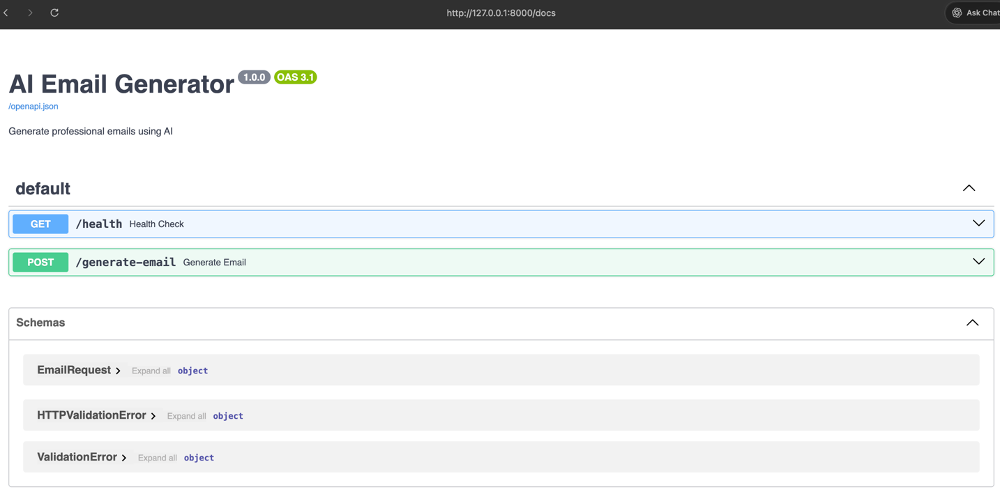

# 📧 02 — AI Email Generator

An AI-powered email generation system built using FastAPI and OpenAI API.

This project helps you learn how real-world Generative AI applications are built by combining:

- Backend APIs
- Prompt engineering
- Structured user input
- AI-generated responses
- FastAPI architecture

---

# 🎯 Project Goal

Build an AI application that:

- Generates professional emails
- Supports multiple tones
- Creates subject lines
- Accepts structured user input
- Exposes REST API endpoints

---

# 🧠 Concepts You Will Learn

## Generative AI Concepts

- Prompt engineering
- Structured prompting
- Context injection
- Response formatting

## Backend Concepts

- FastAPI
- REST APIs
- Request validation
- Response handling

## Python Concepts

- Modular architecture
- Pydantic schemas
- Error handling
- Environment variables

## API Concepts

- POST requests
- JSON payloads
- API testing
- Swagger documentation

---

# 🛠 Tech Stack

| Area                   | Technology    |
|------------------------|---------------|
| Language               | Python        |
| Backend                | FastAPI       |
| AI API                 | OpenAI API    |
| Validation             | Pydantic      |
| Environment Management | python-dotenv |
| API Server             | Uvicorn       |

---

# 📂 Project Structure

```txt
02-ai-email-generator/
│
├── app/
│   ├── __init__.py
│   ├── email_generator.py
│   ├── prompts.py
│   ├── config.py
│   ├── schemas.py
│   └── utils.py
│
├── tests/
│   ├── __init__.py
│   └── test_email_generator.py
│
├── templates/
│   └── sample_emails.txt
│
├── main.py
├── .env
├── .gitignore
├── requirements.txt
├── README.md
└── LICENSE
```

---

# 📁 Folder Explanation

## `app/`

Contains the core application code.

### `email_generator.py`

Handles OpenAI API communication.

### `prompts.py`

Stores reusable AI prompts.

### `config.py`

Loads environment variables and app settings.

### `schemas.py`

Pydantic request/response models.

### `utils.py`

Helper functions.

---

## `tests/`

Contains unit tests.

---

## `templates/`

Stores sample email templates and examples.

### `main.py`

FastAPI entry point.

---

# ⚙️ Features

## ✅ Basic Features

- AI-generated professional emails
- Subject line generation
- Tone customization
- Structured API requests
- FastAPI endpoints

## 🚀 Advanced Features (Later)

- HTML email generation
- Gmail integration
- AI reply generator
- Multi-language emails
- Email optimization

---

# 🔑 Environment Variables

Create a `.env` file:

```env
OPENAI_API_KEY=your_openai_api_key_here
```

---

# 📦 Installation

## 1️⃣ Clone Repository

```bash
git clone <your-repository-url>
```

---

## 2️⃣ Navigate to Project

```bash
cd 02-ai-email-generator
```

---

## 3️⃣ Create Virtual Environment

### Windows

```bash
python -m venv venv
venv\\Scripts\\activate
```

### Mac/Linux

```bash
python3 -m venv venv
source venv/bin/activate
```

---

## 4️⃣ Install Dependencies

```bash
pip install -r requirements.txt
```

---

# ▶️ Running the Application

```bash
uvicorn main:app --reload
```

---

# 🌐 API Documentation

After starting the server:

## Swagger UI

```txt
http://127.0.0.1:8000/docs
```

---

# 📥 Example API Request

```json
{
  "purpose": "Request internship opportunity",
  "tone": "professional",
  "recipient": "HR Manager",
  "key_points": [
    "Python developer",
    "Interested in AI",
    "Available immediately"
  ]
}
```

---

# 📤 Example AI Response

```txt
Subject: Application for AI Internship Opportunity

Dear HR Manager,

I hope you are doing well.

My name is Rahul Chauhan, and I am a Python developer
with a strong interest in Artificial Intelligence and
Generative AI systems.

I would love the opportunity to contribute to your team
and further enhance my skills through an internship.

I am available to start immediately.

Thank you for your time and consideration.

Best regards,
Rahul Chauhan
```

---

# 📄 requirements.txt

```txt
fastapi
uvicorn
openai
python-dotenv
pydantic
```

---

# 🧪 Suggested API Endpoints

## Health Check

```http
GET /health
```

---

## Generate Email

```http
POST /generate-email
```

## Swagger
```
http://127.0.0.1:8000/docs
```


---

# 🚀 Future Improvements

## Version 2

- Better prompt templates
- Multiple email styles
- Email rewrite feature
- AI grammar correction

## Version 3

- Gmail integration
- AI smart replies
- Email scoring
- Personalization engine
- Multi-language support

---

# 🏆 Learning Outcome

After completing this project, you will understand:

- FastAPI fundamentals
- AI backend architecture
- Prompt engineering
- API request validation
- Structured AI outputs
- Professional AI app structure

This project builds the foundation for:

- AI SaaS products
- AI copilots
- AI automation systems
- Enterprise AI applications

---

# ⭐ Best Practices

✅ Used environment variables  
✅ Kept prompts modular  
✅ Validated user input  
✅ Wrote clean APIs  
✅ Used proper folder structure  
✅ Added API documentation  

---

# 📚 Recommended Resources

## FastAPI Docs

https://fastapi.tiangolo.com/

## OpenAI API Docs

https://platform.openai.com/docs/

## Pydantic Docs

https://docs.pydantic.dev/

---


## Demo

### Sample Requests

```
curl --location 'localhost:8000/generate-email' \
--header 'Content-Type: application/json' \
--data '{
  "purpose": "Request internship opportunity",
  "tone": "professional",
  "recipient": "HR Manager",
  "key_points": [
    "Python developer",
    "Interested in AI",
    "Available immediately"
  ]
}'
```


https://github.com/user-attachments/assets/a0afc34e-3dc4-45d7-ad6c-3380551e7d6e

